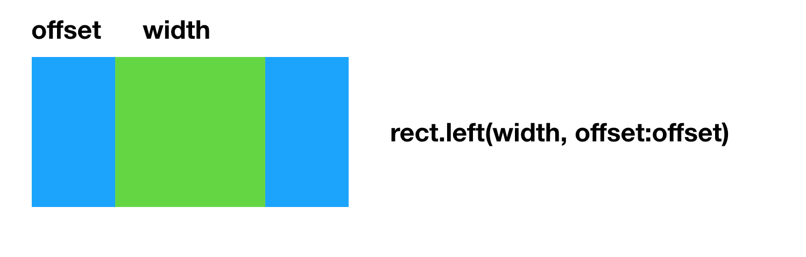
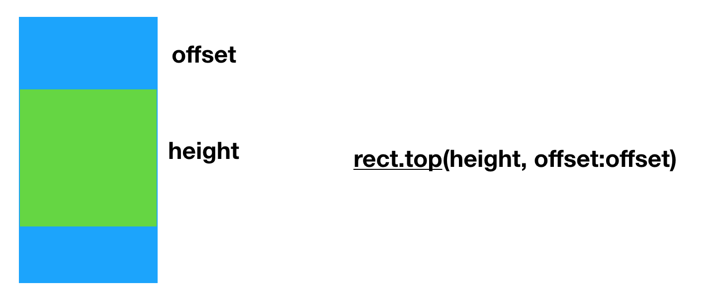
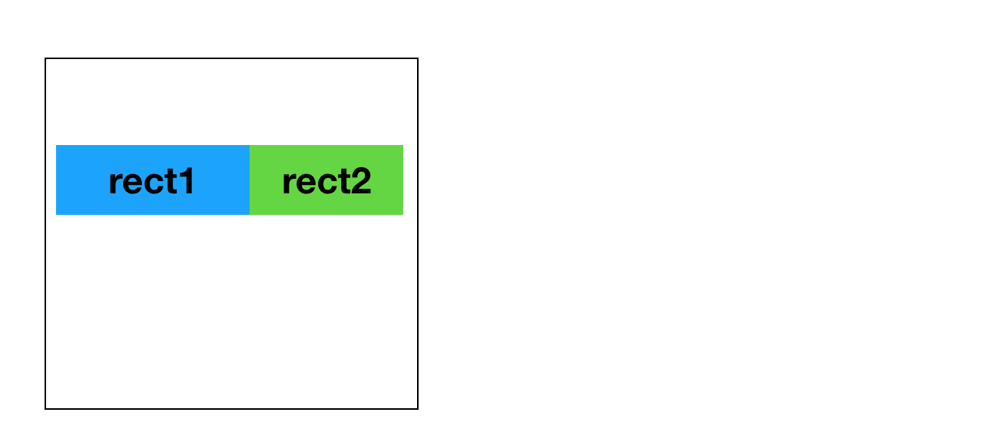

func left(_ v:CGFloat = 0.5, offset:CGFloat) -> CGRect
v >= -1 and v <= 1 
width = rect.width * v 
else
width = v 

func top(_ v:CGFloat = 0.5, offset:CGFloat) ->CGRect

let inrect = rect.inset(by: UIEdgeInsets(top: 10, left: 15, bottom: 0, right: 15))
let line = inrect.top(50,offset:60)
let rect1 = line.left(120)
let rect2 = line.righ(-120)

or

let rect1 = rect.inset(by: UIEdgeInsets(top: 10, left: 15, bottom: 0, right: 15)).top(50,offset:60).left(120)
let rect2 = rect.inset(by: UIEdgeInsets(top: 10, left: 15, bottom: 0, right: 15)).top(50,offset:60).left(-120)